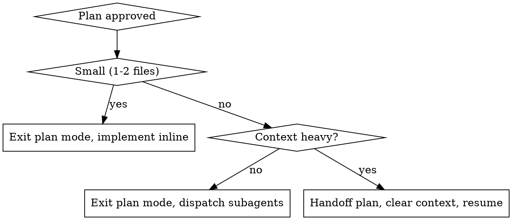

# Build-Guard

Plan in isolation, implement with guardrails. Fully autonomous after approval.

## Phase 1 — PLAN (read-only)

1. **Enter plan mode** — call `EnterPlanMode`. No code changes until Phase 2
2. **Explore** — use Read, Grep, Glob to understand every file related to the task, plus their direct callers and dependents
3. **Write a numbered plan:**
   - Each file to change and what changes are needed
   - Dependencies between changes (order matters)
   - Potential regression risks per change
   - Estimated complexity: **small** (1-2 files), **medium** (3-5 files), **large** (6+ files)
4. **Present the plan** for user approval

**If context is heavy after planning** (exploration consumed significant context): run `/handoff` to save the plan, then the user can clear context and resume with full budget for implementation. If remembrall is not installed, save the plan to `docs/plans/` as a file instead.

## Phase 2 — IMPLEMENT

5. **Exit plan mode** — call `ExitPlanMode`

**Small plans (1-2 files):** implement directly, one file at a time.

**Medium/large plans:** dispatch subagents.
- One subagent per file or logical chunk (files that must change together)
- Each subagent receives: the plan, its specific task, and relevant file context
- Use `Agent` tool with a clear prompt describing exactly what to change and why

6. **After each file/subagent completes:**
   - Review the changes (read the modified files)
   - Run the project's type checker — fix errors before moving on
7. **After every 3 completed files**, or sooner if a change touches a shared interface:
   - Run the full test suite
   - If any test breaks: **stop immediately**, analyze root cause, explain before continuing
   - If the approach is fundamentally wrong: revise the plan, inform the user
8. **After all changes:** run the full test suite and type checker one final time

## Phase 3 — VERIFY

9. **Invoke `review-gate`** — execute the review-gate skill now. Do not declare done until review-gate has completed and all findings are resolved

## Rules

- Never skip the plan phase
- Never batch multiple file changes between verification steps
- If no test suite exists: state this, verify manually by reading affected code paths
- If no type checker exists: skip type checking, proceed with tests
- If patrol plugin is active: comply with its warnings. Read files before editing
- If remembrall nudges about context: run `/handoff` before continuing
- Never declare done without completing review-gate — non-negotiable
